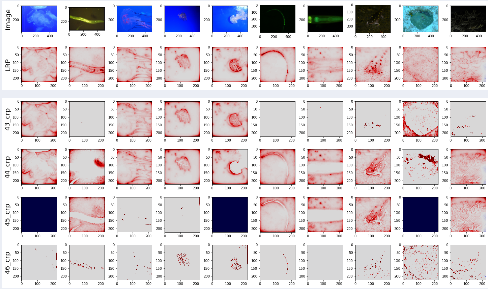

# crp_pytorch


Implementation of Concept Relevance Propagation with pytorch. check [crp_notebook.ipynb](crp_notebook.ipynb) for use case. 





## File Structure

```bash
📦crp_pytorch
 ┣ 📂 src  # includes all python files
 ┃ ┣ 📂 lrp # inclues lrp implementation 
 ┃ ┃ ┣ 📂 modules
 ┃ ┃ ┃ ┣ 🐍 __init__.py
 ┃ ┃ ┃ ┣ 🐍 activation.py
 ┃ ┃ ┃ ┣ 🐍 conv2d.py       # 🚀 CRP is implemented by masking here!
 ┃ ┃ ┃ ┣ 🐍 dropout.py
 ┃ ┃ ┃ ┣ 🐍 flatten.py
 ┃ ┃ ┃ ┣ 🐍 input.py
 ┃ ┃ ┃ ┣ 🐍 linear.py
 ┃ ┃ ┃ ┣ 🐍 pool.py
 ┃ ┃ ┃ ┗ 🐍 utils.py
 ┃ ┃ ┗ 🐍 __init__.py
 ┃ ┣ 🐍 data.py         # ImageNet transform
 ┃ ┗ 🐍 vggExplainer.py # wrapper for activation store (needless)
 ┣ 📜 .gitignore
 ┣ 🪙 LICENSE
 ┣ 📖 README.md
 ┣ 🏙 image.png 
 ┗ 🪐crp_notebook.ipynb
```


## How to use 

Find the lines below in  [crp_notebook.ipynb](crp_notebook.ipynb),

#### 1. ImageNet Validation Path 

Download [ImageNet dataset](https://image-net.org/challenges/LSVRC/2012/) or modify the any other dataset.


```python
# ============================================
# change!
data_path = "/data3/bumjin_data/ILSVRC2012_val"
testset = torchvision.datasets.ImageNet(root=data_path, split="val")
# ============================================
```

#### 2. VGG16 layer, filter indices, and samples

```python
# ===================================
# Which CNN layer / CNN filter index / samples?
layer = 0
conept_ids = [43,44,45,46]  # CNN filter indexes
samples = [5373, 5568, 5367, 5396, 5357] + [5586,5577,1411,5494,3391] # samples you want to check 
# ===================================

```


